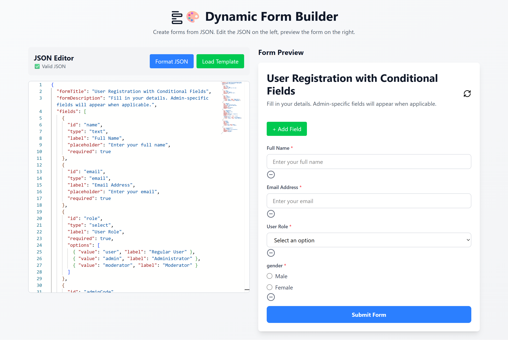

# 🧩 Dynamic Form Generator with JSON Editor

A powerful React + TypeScript application that allows you to **build, edit, and preview dynamic forms using JSON schema** in real-time. It includes a Monaco-based editor, schema validation, conditional fields, and a live form renderer.

---

## 🚀 Features

- 📝 **JSON Editor (Monaco)**
  - Syntax highlighting
  - Auto-formatting
  - Live validation

- ✅ **Schema Validation (AJV)**
  - Validates JSON structure against schema
  - Displays inline errors with exact line mapping

- 🧠 **Dynamic Form Rendering**
  - Generates forms from JSON configuration
  - Supports multiple field types

- 🔀 **Conditional Fields**
  - Show/hide fields dynamically using:
    - `dependsOn`
    - `dependsOnValue`
    - `showWhen` (`includes`, `notEquals`)

- 🧱 **Nested Fields Support**
  - Grouped fields (field inside field)

- 💾 **Local Storage Persistence**
  - Saves JSON and form data automatically

- 🛠️ **Form Builder Mode**
  - Add/remove fields dynamically
  - Create select/radio options on the fly

---

## 🏗️ Tech Stack

- **Frontend:** React + TypeScript
- **Editor:** Monaco Editor (`@monaco-editor/react`)
- **Validation:** AJV (Another JSON Validator)
- **Icons:** Lucide React
- **Styling:** Tailwind CSS

---

## 📌 JSON Schema Overview

Example structure:

```json
{
  "formTitle": "User Registration",
  "formDescription": "Fill your details",
  "fields": [
    {
      "id": "email",
      "type": "email",
      "label": "Email",
      "required": true
    }
  ]
}
```

---

## 🔀 Conditional Fields Example

```json
{
  "id": "adminCode",
  "type": "text",
  "label": "Admin Code",
  "dependsOn": "role",
  "dependsOnValue": ["admin"],
  "showWhen": "includes"
}
```

---

## 🎯 Supported Field Types

- `text`
- `email`
- `number`
- `textarea`
- `select`
- `checkbox`
- `radio`
- `date`
- `group` (nested fields)

---

## ⚙️ Installation

```bash
git clone https://github.com/choksidhrumil2000/dynamic-form-builder.git
cd dynamic-form-builder
npm install
npm run dev
```

---

## 🧪 Validation Rules

- Required fields
- Email format validation
- Number validation
- Date format validation
- Enum/type validation via AJV

---

## 🧠 How It Works

1. Write JSON in the editor
2. JSON is validated using AJV
3. Valid JSON is converted into form structure
4. Form renders dynamically
5. User input is stored in state/localStorage

---

## 📸 Screenshots (Optional)



---

## 🤝 Contributing

Contributions are welcome! Feel free to open issues or submit PRs.

---

## 📄 License

MIT License

---

## Deployed Link

[Dynamic Form Builder](https://dynamic-form-builder-blond-zeta.vercel.app/)

---

## 👨‍💻 Author

Your Name
GitHub: https://github.com/choksidhrumil2000

---
